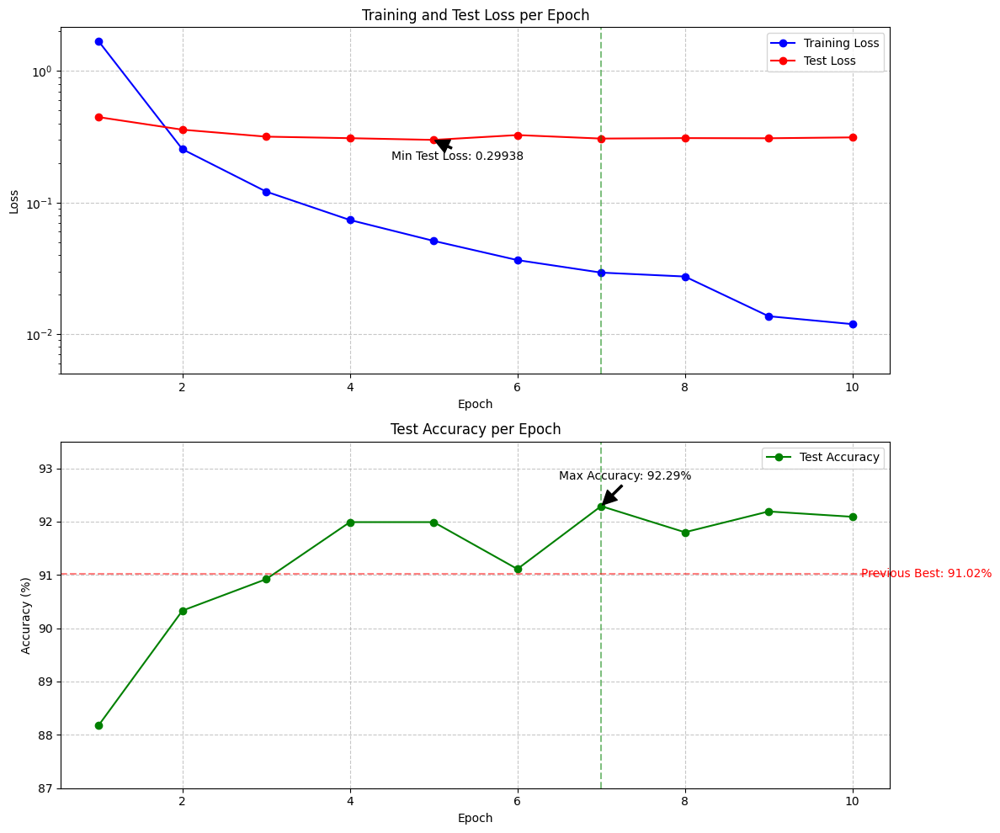

Food5-PyTorch
🍔 Food Classification Model
- This is a deep learning model for food image classification, trained using PyTorch on a custom dataset.

📌 Dataset
- The model is trained on a subset of the Food-101 dataset.

🚀 Deployment
- Available on Hugging Face: Food Model

🔹 Features
- ✅ Uses MobileNetV2 for fast and efficient classification.
- ✅ Trained on 5 food categories.

📊 Training Results
- Here’s the model's performance over 10 epochs:

📂 Files
- 📜 food_classification.ipynb - Google Colab notebook with training code.
- 📦 model.pth - Pre-trained model weights.
- 📜 requirements.txt - Dependencies to install.
- 📂 dataset_sample/ - Example images from the dataset.
